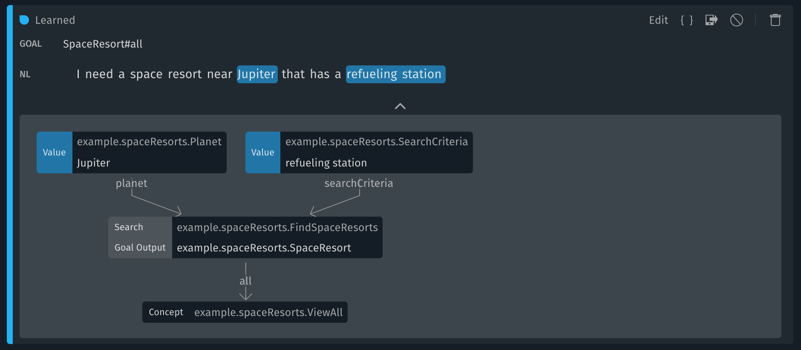
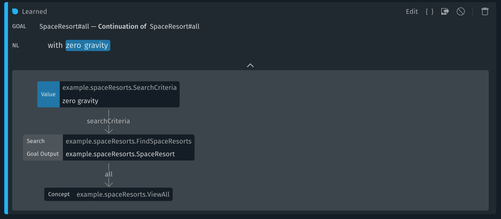
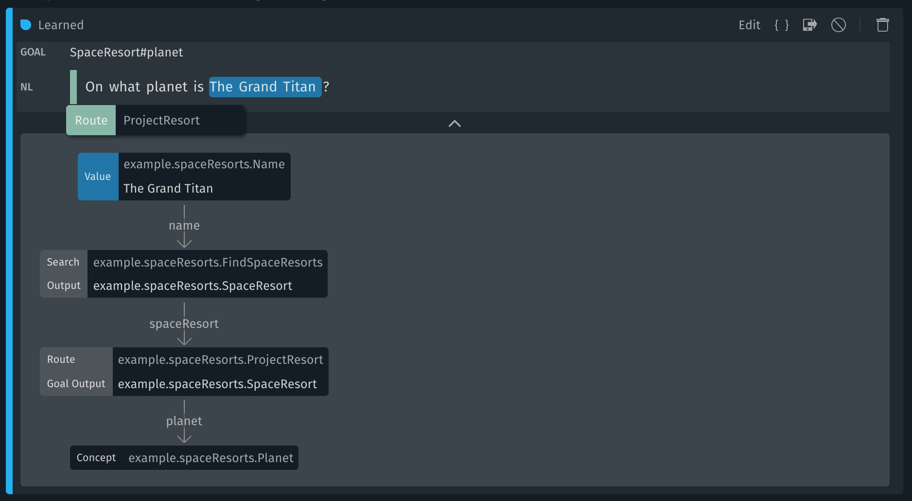
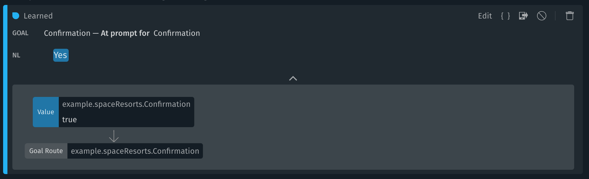
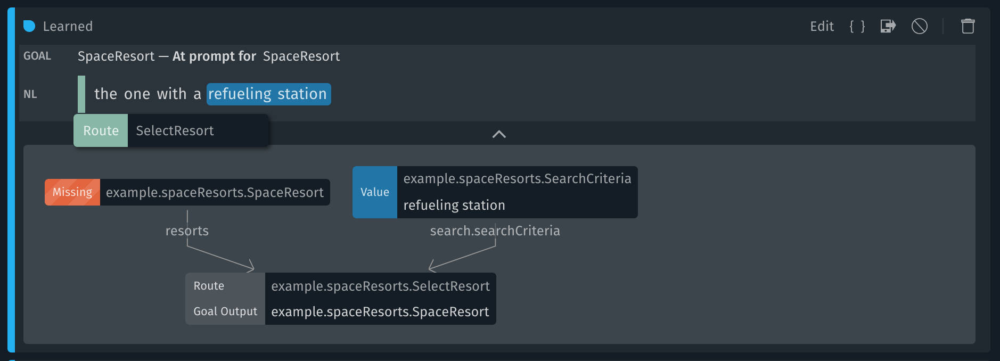
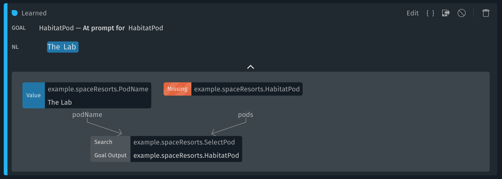

<p align="Center">
  
  <br/>
  <h1 align="Center">Bixby Space Resorts Sample Capsule</h1>
</p>

## Overview

This capsule is the the companion code to the Bixby [Space Resorts Sample Capsule](https://bixbydevelopers.com/dev/docs/sample-capsules/walkthroughs/space-resorts) guide. Space Resorts is a fun capsule that allows you to book a space vacation! You can find a space resort, book a reservation, look up a reservation, and change or cancel a reservation. This advanced capsule demonstrates development and design of [searches](https://bixbydevelopers.com/dev/docs/sample-capsules/walkthroughs/simple-search), [transactions](https://bixbydevelopers.com/dev/docs/dev-guide/developers/modeling.modeling-actions.transactional-workflows) and [UI](https://bixbydevelopers.com/dev/docs/dev-guide/developers/building-views).

---

## Use cases

### Finding Space Resorts

#### Outer "find" Queries



You can see all trained utterances and plans by entering this query in the
training tab search bar: `goal:SpaceResort#all -has:continue`. Examples:

- Find space resorts

- Show me space hotels with crater canyoneering

- Search for hotels around The Red Planet

- Look for space hotels with quantum bungee jumping around Saturn

We train these to have the goal `SpaceResort#all` and annotate any resort names,
planets and search criteria as Values. Here `SpaceResort#all` is a property
projection to the `all` property of the `SpaceResort`. This property is a
boolean of type `ViewAll`, which is always true and is used as a proxy to
signify that we want to display the full space resort, instead of focusing on a
single property like `gravity` or `planet` (see property projections below). A
match-pattern ties the views and dialogs for this property projection to
describe the whole hotel.

```
match {
  ViewAll(all) {
    from-property {
      SpaceResort (result)
    }
  }
}
```

Why do we treat this as a property projection instead of setting the goal to the
`SpaceResort` Structure?

When the user wants to book a space resort and there are many possible
candidates in context, the user picks a single one using a selection prompt, in
order to continue with the booking (see SpaceResort Selection Prompt selection
below for full details). The context for that prompt is `SpaceResort`, and
**selection prompt training must always have the same goal as its context**.
Accordingly, selection prompt training for `SpaceResort` needs to use
`SpaceResort` as its goal.

The selection prompt training also uses a special flagged signal to route the
plan through the `SelectResort` action that filters the hotels currently in
context based on the newly provided inputs. It is crucial to add the
`SelectResort` flagged signal to the selection prompt training annotations to
achieve this behavior.  However, we do not want to add the `SelectResort`
flagged signal to the "find" queries because these should issue a new search via
the `FindSpaceResorts` action instead of filtering existing results via the
`SelectResort` action. Since the selection prompt requires different annotations
patterns compared to the "find" queries, and **annotation patterns must be
consistent for the same goal**, this means that they must use a different goal.

This example demonstrates two points.  First, the selection prompt
training must use `SpaceResort` as a goal. Second, that the "find" queries
must use a different goal than the selection prompts. By putting these together,
we deduce that the "find" queries cannot use `SpaceResort` as a goal. Therefore,
we use a distinct goal (`SpaceResort#all`) for the "find" queries in order to
provide consistent annotation patterns per goal.

Why don't we set the goal to the `FindSpaceResorts` action?

Another alternative would be to set the goal to the specific `FindSpaceResorts`
action, making it very clear how to fulfill the request. This approach would
simplify the match patterns for views, so we would not need to use the
`from-property` key. However, we use the property projection approach
so that our final resting context for "find" queries is the same as for property
projection queries.  This means that we can pivot between all these states
seamlessly, or launch the "book" flow from any of these. Example conversation:

1. Find space resorts

2. The second one

3. What planet is it on?

4. What's the gravity there?

5. Book it

#### Inner "find" Queries (Continuations)



You can see all trained utterances and plans by entering this query in the
training tab search bar: `goal:SpaceResort#all has:continue`. Examples:

- On Jupiter

- With low gravity

- Only the ones that are kid-friendly

These are continuations of the outer "find" queries that allow users to refine
their space resorts search by providing additional inputs. Since the goal for
outer "find" queries is `SpaceResort#all`, we annotate both the goal and the
"Continuation of" to also be `SpaceResort#all`.  Any resort names, planets and
search criteria are annotated as Values.  This reissues a search with the new
inputs being added to those already in context.

### Property Projection Flows (Planet, Gravity)

#### Outer Property Projections



You can see all trained utterances and plans by entering this query in the
training tab search bar: `goal:SpaceResort#* -goal:SpaceResort#all
-has:continue`. For example:

- What's the gravity at The Mercurial?

- Where is Io-Tel?

Here, the user is asking to know about a specific property of a space resort,
such as the gravity or the planet.  We train the goal to be that property
projection (ex: `SpaceResort#gravity`), and we annotate any resort names,
planets and search criteria as Values.  We also add a special flagged signal
route to `ProjectResort`.  This is in case there were multiple space resorts
that matched the search inputs.  Then the `ProjectResort` action will ask the
user to select a single space resort before providing the answer.

#### Inner Property Projections (Continuations)


You can see all trained utterances and plans by entering this query in the
training tab search bar: `goal:SpaceResort#* -goal:SpaceResort#all
has:continue`. For example:

- What's the gravity there?

- What planet is it on?

We train these just like the outer property projections, with the addition of a
"Continuation of" `SpaceResort`.  This allow pivoting between inner/outer "find"
queries and inner/outer property projections.

### Booking Space Resorts

#### Outer "book" Queries

You can see all trained utterances and plans by entering this query in the
training tab search bar: `goal:Order#commitOrder -has:continue`. For example:

- Make a reservation for a space resort on Mars the third weekend in December
for 2 astronauts

We train these to the goal `Order#commitOrder` where `commitOrder` is a
named-consumer on the `Order`. We also add two flagged signal routes:
`CreateItem` and `CreateOrder`.  We annotate as Values any present inputs for
either "find" or "book", such as resort name, planet, search criteria, number of
astronauts, etc.  All this will create a plan to first find a space resort that
matches the search inputs, then prepare an `Order` and pass it to the
`CommitOrder` action, which will present the user with a Confirmation screen to
review and agree to the reservation.

#### Inner "book" Queries (Continuations of SpaceResort)

You can see all trained utterances and plans by entering this query in the
training tab search bar: `goal:Order#commitOrder continuation:SpaceResort`. For
example:

- Make reservation

- Book a pod for 2 astronauts

We train these just like the outer "book" queries, with the addition of a
"Continuation of" `SpaceResort`.  This is to cover cases where the users are
already browsing space resorts and want to initiate a booking for one of the
results in context.

#### Inner "Change Order" Queries (Continuations to change the Order)

You can see all trained utterances and plans by entering this query in the
training tab search bar: `goal:Order#commitOrder
continuation:Order#commitOrder`. For example:

- Pick a different habitat pod

- Change that to 2 astronauts

- Select a different date

We train these as "Continuation of" `Order#commitOrder` for cases where the
users are at the Confirmation screen to review their order and decide that they
want to make some changes.  The goal remains `Order#commitOrder`, and any Values
are annotated as such (ex: number of astronauts, pod name).  This time, the
flagged signal route is to `ChangeOrder`.  This is to re-route the request to
update the Order with the newly provided information.  For generic requests that
do not contain a new input Value (ex: Change the number of astronauts), we
add an extra flagged signal route to the action for that request (ex:
GetNumberOfAstronauts).

### Prompting Flows

#### Confirmation Prompt



You can see all trained utterances and plans by entering this query in the
training tab search bar: `prompt:Confirmation`. For example:

- Yes

- Do it

When the user is done reviewing their Order at the Confirmation Prompt, they can
use these utterances to move forward and proceed with the reservation. This is
an "At prompt for" `Confirmation` with goal `Confirmation`.  The Confirmation
itself is annotated with a boolean Value "true" or "false".

#### SpaceResort Selection Prompt



You can see all trained utterances and plans by entering this query in the
training tab search bar: `prompt:SpaceResort`. For example:

- The one with a refueling station

- The Mercurial

- The one on Venus

The booking flow only allows a single SpaceResort at a time, so when there are
multiple candidates, the user will be presented with a `SpaceResort` Selection
Prompt.  For prompt training, the goal must always match the prompt context, so
we train these as "At prompt for" `SpaceResort` with goal `SpaceResort`. There
are many ways the user can answer, so we annotate any provided Value (space
resort name, planet, search criteria) and add a special flagged signal route to
the `SelectResort` action.  This action will take the hotels currently in
context and attempt to filter them based on the newly provided inputs.  For
example:

- User: Book a hotel near Jupiter

- Bixby: Here are some hotels around Jupiter. Which one would you like?

- User: The one with a refueling station.

- Bixby: There are 3 hotels around Jupiter with a refueling station. Which one?
(Where the 3 options are a subset of the previous options, not a new search)

- User: The Ganymede Moon Motel

- Bixby: (Proceeds with the booking flow)

#### Other Selection Prompts (NumberOfAstronauts, HabitatPod, DateInterval...)



You can see all trained utterances and plans by entering this query in the
training tab search bar: ` has:prompt -goal:SpaceResort -goal:Confirmation`. For
example:

- 3 astronauts

- The Honey Moon Suite

- Next weekend

For prompt training, the goal must always match the prompt context, so we train
these as "At prompt for" `<Concept>` and goal `<Concept>`.  Then we annotate the
Value in the utterance for that `<Concept>`. For example, "At prompt for"
`HabitatPod` has goal `HabitatPod` and the `PodName` is annotated as a value.

---

## Additional Resources

### Your Source for Everything Bixby
* [Bixby Developer Center](http://bixbydevelopers.com) - Everything you need to get started with Bixby Development!

### Guides & Best Practices
* [Quick Start Guide](https://bixbydevelopers.com/dev/docs/get-started/quick-start) - Build your first capsule
* [Design Guides](https://bixbydevelopers.com/dev/docs/dev-guide/design-guides) - Best practices for designing your capsules
* [Developer Guides](https://bixbydevelopers.com/dev/docs/dev-guide/developers) - Guides that take you from design and modeling all the way through deployment of your capsules

### Video Guides
* [Introduction to Bixby](https://youtu.be/DFvpK4PosvI) - Bixby and the New Exponential Frontier of Intelligent Assistants
* [Bixby Fundamentals](https://bixby.developer.samsung.com/newsroom/en-us/22/01/2019/Teaching-Bixby-Fundamentals-What-You-Need-to-Know) - Bixby Fundamentals: What You Need to Know

### Need Support?
* Have a feature request? Please suggest it in our [Support Community](https://support.bixbydevelopers.com/hc/en-us/community/topics/360000183273-Feature-Requests) to help us prioritize.
* Have a technical question? Ask on [Stack Overflow](https://stackoverflow.com/questions/tagged/bixby) with tag “bixby”
